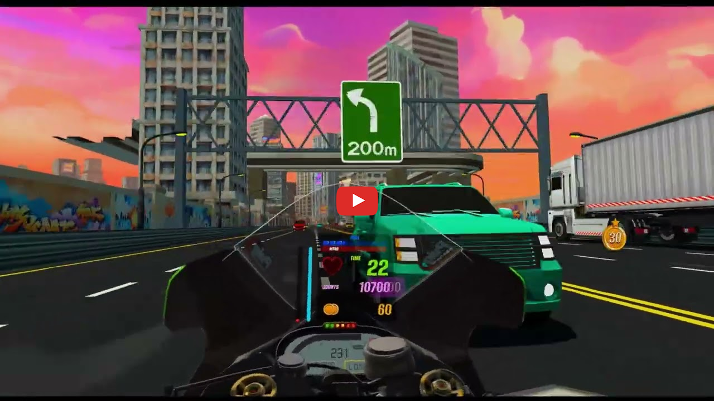

# VRIDER eXtreme

## About

VRider X is an adrenaline-fueled VR arcade racing game where players dodge traffic at over 180 mph, perform daring maneuvers for points, and extend their runs by collecting fuel.
Use Nitro Boost and Power-Ups to supercharge your ride, execute breathtaking jumps, and customize your bike with unique visuals and upgrades.
Race solo or socially with Casual Free Roam, where players meet, showcase bikes and lend rides.
Challenge the world in 3 multiplayer modes: Elimination Frenzy (last rider standing wins), Team Battles (outrun or overtake opponents), and Extreme Races (dynamic courses with power-ups and missions).
Designed for thrill-seekers, casual gamers, and bike fanatics, VRider X offers unlockable bikes, enhanced handling, and deep customization.
Whether you’re a social competitor or an arcade racing fan, VRider X delivers fast-paced VR action with high replayability. Get ready to race, customize, and dominate the leaderboard!

## Genre
Arcade Racing

## Game Mode
Single-player, Multiplayer (Elimination Frenzy, Team Battles, Extreme Races), Casual Free Roam

## Business Model
Premium + In-App Purchases for bike customization, power-ups, and additional content

## Status
PoC and Design Available

## Looking for
With a Premium + In-App Purchases model, we aim to deliver a high-speed, high-replayability racing experience for thrill-seekers and casual gamers alike.
